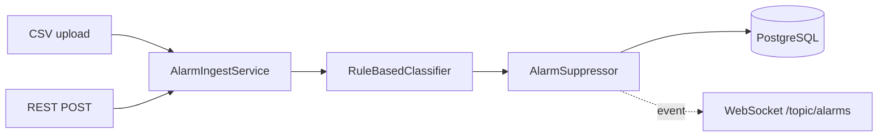

# process-alarm-broker

Event-driven microservice that ingests industrial process alarms (CSV upload or REST push), classifies them by severity, deduplicates alarm floods, persists to PostgreSQL, and broadcasts non-suppressed alarms over WebSocket.


## Architecture



The pipeline is wired with `ApplicationEventPublisher` so the WebSocket layer is fully decoupled from the persistence path. Swap in Kafka or SQS by replacing the publisher.

## Quick start

One-time: generate the Gradle wrapper (requires Gradle 8+ on PATH).

```bash
gradle wrapper --gradle-version 8.10
docker compose up --build
```

App on `:8080`, Postgres on `:5432`. Flyway runs migrations automatically.

## API

| Method | Path                  | Description                              |
|--------|-----------------------|------------------------------------------|
| POST   | `/api/alarms`         | Ingest single alarm (JSON `AlarmDTO`)    |
| POST   | `/api/alarms/csv`     | Ingest batch (multipart CSV)             |
| GET    | `/api/alarms`         | Search: `from`, `to`, `severity`, `section`, `suppressed`, `page`, `size` |
| GET    | `/api/alarms/{id}`    | Fetch single alarm by UUID               |
| GET    | `/api/alarms/stats`   | Counts by severity, top sensors, rate    |
| WS     | `/ws` → `/topic/alarms` | STOMP push of accepted alarms          |

### Examples

```bash
curl -X POST http://localhost:8080/api/alarms \
  -H 'Content-Type: application/json' \
  -d '{"sensor_id":"ABS-temperature-001","plant_section":"ABSORBER","metric":"temperature_C","value":135.2,"timestamp":"2025-07-15T14:30:00Z"}'

curl -X POST -F 'file=@src/test/resources/test-alarms.csv' http://localhost:8080/api/alarms/csv

curl 'http://localhost:8080/api/alarms?severity=HIGH&suppressed=false'
curl http://localhost:8080/api/alarms/stats
```

## Design decisions

- **Event-driven over direct calls** — keeps the broadcast layer decoupled and makes Kafka/SQS swap-in mechanical.
- **Suppression matters** — industrial alarms cluster in floods (one upset condition trips dozens of correlated sensors). Without dedup, downstream UIs are unusable. The current implementation is in-memory; production should back this with Redis SETEX so multiple instances share state.
- **Flyway over `ddl-auto`** — migrations are reviewable, versioned, and CI-runnable. Auto-DDL is fine for prototypes and a footgun for production.
- **Records + sealed interfaces** — `AlarmEvent` uses Java 21 sealed types so the WebSocket listener can pattern-match exhaustively.
- **Testcontainers** — repository tests run against real Postgres, not H2.

## What I'd add in production

- Kafka or SQS as the event transport (durable, replayable)
- Redis-backed suppression state (cluster-wide)
- Prometheus metrics + Grafana dashboards (alarm rate, suppression ratio, ingest latency)
- OpenAPI spec via springdoc
- Auth (mTLS or OAuth2) on ingest endpoints
- Schema registry for the inbound DTO
